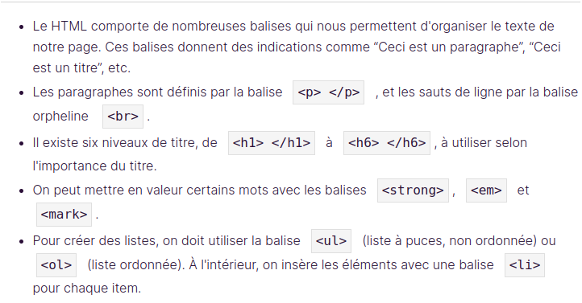

# FORMATION HTML & CSS Openclassroom
## HTML
Nous avons les balises de base en HTML

Ceci est un type de lien hypertexte appelé un lien absolu
`
Lien vers openclassroom  <a href="https://openclassrooms.com">ici</a>
`
**Dans href on peut mettre le chemin vers notre autre fichier ou le nom d'un id precedé d'un # pour nou ramener à un endroit précis de notre page**
**Et si l'ID se trouve dans un autre fichier on va mettre dans la valeur du href="nom_fichier_ou_chemin#nom_id"**
**L'attribut target="_blank" dans la balise permet d'ouvrir la cible dans un nouvel onglet que l'onglet actuel**
`href = "mailto: adressemail@gmail.com"` permet de creer un lien vers l'ouverture de la boite mail avec un nouveau message vide vers l'adresse indiqué et `href  = "nom_du_fichier_ou_chemin_du_fichier.extension` permet de creer un lien lien pour telecharger un fichier au prealable dans le meme dossier que notre page web.
