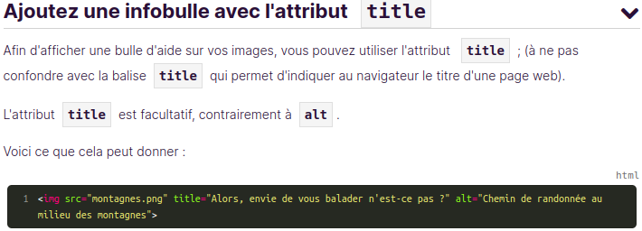
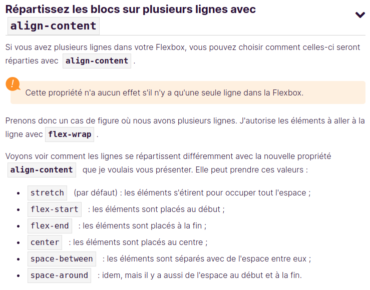
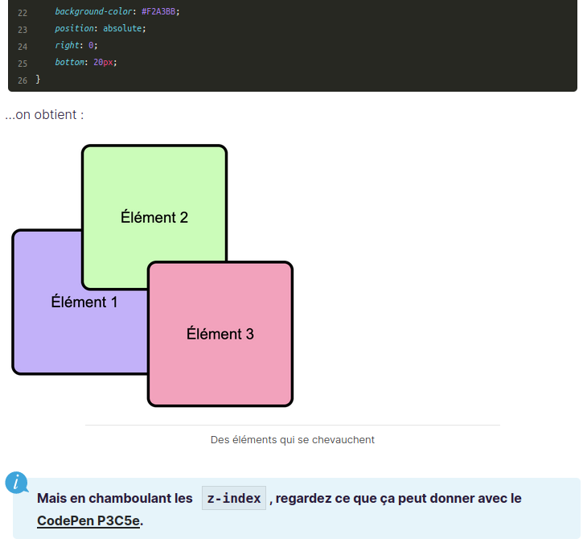

# FORMATION HTML & CSS Openclassroom
## HTML

### 1. Les balises de base
Nous avons les balises de base en HTML

### 2. Les balises universelles

C'est une balise de type **inline** c'est-à-dire une balise que l'on place au sein d'un paragraphe de texte pour sélectionner certains mots uniquement.

### 3. Les ancres(Les liens) 
Ceci est un type de lien hypertexte appelé un lien absolu
`
Lien vers openclassroom  <a href="https://openclassrooms.com">ici</a>
`
**Dans href on peut mettre le chemin vers notre autre fichier ou le nom d'un id precedé d'un # pour nou ramener à un endroit précis de notre page**
**Et si l'ID se trouve dans un autre fichier on va mettre dans la valeur du href="nom_fichier_ou_chemin#nom_id"**
**L'attribut target="_blank" dans la balise permet d'ouvrir la cible dans un nouvel onglet que l'onglet actuel**
`href = "mailto: adressemail@gmail.com"` permet de creer un lien vers l'ouverture de la boite mail avec un nouveau message vide vers l'adresse indiqué et `href  = "nom_du_fichier_ou_chemin_du_fichier.extension` permet de creer un lien lien pour telecharger un fichier au prealable dans le meme dossier que notre page web.

## 4. La balise ``
Pour ajouter une infobulle lorsque la souris survole notre image sur la page web on doit ajouter l'attribut `title = ""` et comme valeur on lui donne le texte qui sera affiché lorsque la souris survole notre image.

 

## CSS

### 1. Syntaxe de base du CSS

En CSS la syntaxe générale est la suivante :

### 2. Les fifférentes epaisseurs de texte en CSS
 L'epaisseur du texte est donné à un texte dans une balise grace à la proprieté `font-weight` et les valeur qu'elle peut prendre sont listés sur l'image ci-dessous :

  

### 3. Comment utiliser une police externe sur notre page web

Pour utiliser une police externe sur notre page web on va utiliser la proprieté CSS `font-family` et en valeur on va lui donner le nom de la police selectionnée, les etapes pour faire cela sont definies sur la photos suivante :

### 4. Soulignement du texte en CSS

Pour définir des soulignement on utilise la proprieté `text-decoration` et il peut prendre comme valeurs, les valeurs listés sur la photo suivante:

### 5. Modification du comportement d'une image de fond en CSS

Pour modifier le comportement d'une image de defond en CSS on utilise la proprieté `background` et il peut prendre diverses formes comme indiqué à l'image ci-dessous:

### 6. Création des dégradés

Pour créer des dégradés en CSS on utilise la proprieté `linear-gradient` qui prend commme valeur une lise de valeurs particulieres comme `(90deg, #360C3, #2EBF91)`, le premier parametre est le degré qui va separer les deux couleurs puis on met la couleur qui va commencer et la seconde valeur est la couleur qui va finir. Un exemple à l'image ci-dessous:

### 7. Gestion de l'opacité de l'image en CSS

### 8. Ajouter des ombres en CSS

Pour ajouter l'ombre à un element CSS pour les balises conteneur on utilise la proprieté `box-shadow` et pour le texte on utilise `text-shadow` et les explications concernants les valeurs de ces proprieté s'equivalent.

On peut aussi adoussir l'ombre des element en suivant cette syntaxe :

On peut aussi qjoutes des ombres su des texte avec la proprieté `text-shadow` avec la syntaxe suivante:

### 9. Arrondissement des bords des éléments HTML

Pour faire un arrondissement des bords independants pour chaque coin la procédure est la suivante:

 

On peut aussi créer des elipses avec du CSS en utilisant la syntaxe suivante:

**Resumé de box-shadow et border-radius**

### 10. CREATION DES APPARENCES DYNAMIQUES

### 11. QUELQUES SELECTEURS SPECIAUX

### 12. STRUCTURATION DE LA PAGE WEB

**En resumé on a :**

### 12. LES MODELES DE BOITES EN HTML

**Remarque :**

### 13. LES MARGES EN CSS

Il n'est cependant pas possible de centrer verticalement un bloc avec cette technique. Seul le centrage horizontal est permis.

### 14. LA MISE EN PAGE AVEC FLEXBOX

Lorsque on utilise la proprieté-valeur `flex-direction: row-reverse` l'inversion commence à la position du dernier element et on continue avec les elements qui le suivent en partant de la droite vers la gauche, ce qui fait que le dernier element sera l'ancien premier element et il sera le plus à droite de l'ancien premier element aui est devenu le premier element. 
**Remarquez** que quand vous mettez la direction inversée, le début et la fin sont aussi inversés.
cela signifie que meme le `justify-content: flexs-start` et `justify-content: flex-end` sont inversées

- `align-content` permet d'aligner les blocs se trouvant dans un conteneur.
  

- Proprieté **`Order`**

- On a aussi la proprieté **`flex-flow`** 

### 15. LE CSS GRID

Le css grid permet d'aligner le contenu d'un conteneur d'elements HTML sous forme de grille soit en colonne soit en ligne, lorsqu'on utilise la proprieté `grid-template-columns` en specifiant ses valeurs on definit directement le nombre de colonnes et automatiquement ils definit le nombre de lignes nécessaires ex: `grid-template-columns: 100px 200px 300px 200px 100px;` pour cet exemple  on définit 5 colonnes dont chacune d'elle peut avoir sa largeur et la définition des largeurs définit le nombre des colonnes comme on l'a indiqué.
La proprièté `grid-tempplate-rows` permet de specifier qu'on va arranger nos elements sous forme des lignes et pour ca on est obligé de specifier le nombre de colonnes comme dans cet exemple: 
` grid-template-rows: 200px 300px 100px 300px;` suivi ou precedé `grid-template-columns: 200px 200px 200px 200px 200px;` 

Pour un exemple pratique avec le `grid-template-columns` on a :

Pour un exemple pratique avec le `grid-template-rows` on a :

#### 1. LA PROPRIETE GRID-ROWS ET GRID-COLUMNS

Si on veut avoir un resultat pareil:

On doit cibler chaque element de la grille, et lui appliquer les tailles suivant le nombre de colonnes et le nombre des lignes.

Et ainsi dans le code on peut avoir la structure qui suit:

**On a le resultat qui peut ressembler à ceci :**

#### 2. LA PROPRIETE GRID-AREA

#### 3. LA PROPRIETE ORDER DANS GRID

#### 4. LA PROPRIETE REPEAT DE GRID

**La propieté `gap`** permet d'aererer le contenu dans nos conteneur presque comme le ferait un `margin`, ex: `gap: 10px;` il permet d'espacer le contenu de mon conteneur de *10 px* .
La propriété CSS **gap** permet de créer des espacements entre vos éléments. Si vous voulez garder les mêmes distances entre les rangées et les colonnes sans avoir à vous compliquer la vie, vous précisez simplement une valeur.

#### 5. MELANGE DES PROPRIETES TEMPLATES-ROWS ET TEMPLATE-COLUMNS

### 16. LE CHOIX DES UNITES DE MESURE D'ELEMENTS

On peut avoir un exemple:

### MELANGE DES UNITES AVEC LES PROPRIETES GRID

### 16. LA PROPRIETE DISPLAY

La liste des valeurs possibles pour `display` est sur le lien : https://developer.mozilla.org/fr/docs/Web/CSS/display

### 17. LA PROPRIETE POSITION

- **Utilisation de la proprieté position avec la valeur `relative`**

- **Utilisation de la proprieté position avec la valeur `absolute`**

La propriété position **`unset`** réinitialise la propriété afin que sa valeur soit la valeur héritée depuis l'élément parent, ou soit la valeur initiale (s'il n'y a pas d'héritage).

- **Gérez le chevauchement avec la propriété  `z-index`**

- **Bloquez les elements avec `position: fixed` et `position: sticky`**
  
La différence entre `fixed` et `sticky` c'est que ce premier rend l'élement collé sur la page quelque soit le scroll en haut ou en bas mais le second lui rend l'element collé lorsque le scroll atteint sa position  et lorsque on monte plus haut que cet element il descend aussi.
On peut tester au lien: https://codepen.io/nicolaspatschkowski/pen/dyezoyV?editors=1100

- **Positionnement des élements avec `position: absolute` et `position: relative`**

  - L'utilisation de `position: relative` est comme suit:

- L'utilisation de `position:absolute` est comme suit: 

**La différence entre ces deux est que en `relative` les coordonnées(0,0) commencent là se trouve l'élement et à partir de là on peut maintenant le deplacer avec les proprieté supplementaires mais pour `absolute` les coordonnées(0,0) commencent au debut de la page HTML ou au début de l'élement parent ayant aussi la proprieté position, comme le montre l'image avant et c'est à partir de là qu'on peut commencer à le déplacer.**

### 18. GESTION DES CHEVAUCHEMENTS EN CSS

Quand nous avons deplacer nos éément avec la proprieté `position` surtout avec sa valeur `absolute`, on constate que les élements se placent au dessus des autres, ce chevauchement peut etre controlé comme suit:

Alors dans les proprietés des éléments pour lesquels on veut controler le chevauchementon doit inserer la proprieté `z-index="valeur"`, la avleur du z-index est un nombre et l'element ayant la valeur la plus supérieure sera le plus au dessus des autres. 